# UECLI - Unreal Engine Command Line Interface

[English](#english) | 中文

> **MCP 已死，CLI 当立。**
>
> MCP（Model Context Protocol）方案依赖中间代理层，链路长、调试难、协议脆弱。UECLI 反其道而行 —— 一个 TCP Server 嵌入 Editor，任何能发 JSON 的工具直连引擎，零中间层、零依赖、毫秒级响应。AI Agent、脚本、CI 管线，谁都能用。

## 简介

UECLI 是一个 **独立的 UE5 Editor 插件**，通过内置 TCP Server（默认端口 `31111`）暴露 **90+ 条命令**，覆盖材质、编辑器、资产、项目、TextureGraph 五大领域。

- **零依赖**：不依赖 Python / Node / MCP SDK，任何语言 `socket.connect()` 即用
- **嵌入式**：Server 跑在 Editor 进程内，命令在 GameThread 执行，完整访问引擎 API
- **AI-Native**：JSON-in / JSON-out 协议天然适配 LLM Function Calling
- **异步支持**：长耗时操作通过 `async_execute` + `get_task_result` 轮询，不阻塞

## 命令覆盖

| 模块 | 命令数 | 能力 |
|------|--------|------|
| **Editor** | 23 | Actor 增删改查、视口控制、关卡管理、PIE、变换、属性反射 |
| **Material** | 43 | 材质图创建/编辑、节点连接、参数设置、编译、材质函数 |
| **Asset** | 11 | 资产列表、查找、重命名、复制、导入、导出 |
| **Project** | 9 | 输入映射、项目设置、引擎配置 |
| **TextureGraph** | 10 | 创建/编辑 TextureGraph、添加/连接节点、设置属性、导出、批量补丁 |

## 快速开始

### 1. 安装

将 `UECLI/` 复制到项目的 `Plugins/` 目录下，重新编译即可。

### 2. 验证

启动编辑器后，Ping 一下服务器：

```powershell
# PowerShell
powershell -ExecutionPolicy Bypass -File Plugins/UECLI/Scripts/Send-UECLI.ps1 ping
```

```bash
# 或者用任意 TCP 客户端
echo '{"command":"ping","params":{}}' | nc 127.0.0.1 31111
```

### 3. 探索

```powershell
# 列出所有可用命令
powershell -ExecutionPolicy Bypass -File Plugins/UECLI/Scripts/Send-UECLI.ps1 list_tools

# 创建材质
powershell -ExecutionPolicy Bypass -File Plugins/UECLI/Scripts/Send-UECLI.ps1 create_material '{"name":"M_Test"}'

# 生成 Actor
powershell -ExecutionPolicy Bypass -File Plugins/UECLI/Scripts/Send-UECLI.ps1 spawn_actor '{"class":"StaticMeshActor","name":"MyActor"}'
```

## TCP 协议

连接 `127.0.0.1:31111`（可通过 `-uecliport=XXXXX` 覆盖端口）。

```jsonc
// 请求
{"command": "command_name", "params": {"key": "value"}}

// 成功响应
{"status": "success", "data": {...}}

// 错误响应
{"status": "error", "error": "错误描述"}
```

### 异步命令

```jsonc
// 提交
{"command": "async_execute", "params": {"command": "heavy_operation", "params": {...}}}
// → {"status": "success", "data": {"task_id": "xxx"}}

// 轮询结果
{"command": "get_task_result", "params": {"task_id": "xxx"}}
```

## 为什么不用 MCP？

| | MCP | UECLI |
|---|---|---|
| 架构 | App ↔ MCP Server ↔ Proxy ↔ UE | App ↔ UE（直连 TCP） |
| 依赖 | Python/Node 运行时、MCP SDK | 无 |
| 延迟 | ~100ms+（IPC + 协议开销） | <10ms（本地 TCP） |
| 调试 | 多进程，难追踪 | 单进程，`UE_LOG` |
| 稳定性 | 协议版本不匹配、进程崩溃 | 进程内，生命周期与 Editor 绑定 |
| 集成 | 仅 MCP 兼容客户端 | 任意语言、任意工具 |

## 脚本工具

| 脚本 | 用途 |
|------|------|
| `Build-UECLI.ps1` | 通过 UBT 编译插件 |
| `Send-UECLI.ps1` | 向服务器发送单条命令 |
| `Test-UECLI.ps1` | 运行完整自动化测试 |
| `Smoke-UECLI.ps1` | 快速冒烟测试 |

## 源码结构

```
Source/UECLI/
├── Public/
│   ├── UECLIModule.h                     # 模块入口
│   ├── UECLICommandlet.h                 # -run=UECLI 命令行模式
│   ├── ToolRegistry/
│   │   ├── UECLIToolRegistry.h           # 命令注册表单例
│   │   └── UECLIToolSchema.h             # Schema 与参数定义
│   ├── Server/
│   │   ├── UECLIServer.h                 # TCP 服务器（UEditorSubsystem）
│   │   └── UECLIServerRunnable.h         # 监听线程
│   └── Commands/
│       ├── UECLICommonUtils.h            # JSON 工具、序列化、反射
│       ├── UECLIEditorCommands.h         # 编辑器命令
│       ├── UECLIMaterialCommands.h       # 材质命令
│       ├── UECLIAssetCommands.h          # 资产命令
│       ├── UECLIProjectCommands.h        # 项目命令
│       └── UECLITextureGraphCommands.h   # TextureGraph 命令
└── Private/ （与 Public 对应）
```

## 样例：后处理效果一键生成

通过 `Create-PPEffects.ps1` 脚本，UECLI 可以一次性创建 10 种后处理材质、自动切换并截图。整个过程无需手动操作，展示了 **材质创建 → 节点连线 → 编译 → PPV 挂载 → 截图** 的完整自动化链路。

```powershell
powershell -ExecutionPolicy Bypass -File Plugins/UECLI/Scripts/Create-PPEffects.ps1
```

### 效果一览

| 原始画面 | |
|:---:|:---:|
|  | |

| 01 · Desaturate（去饱和） | 02 · Warm Tint（暖色调） |
|:---:|:---:|
| 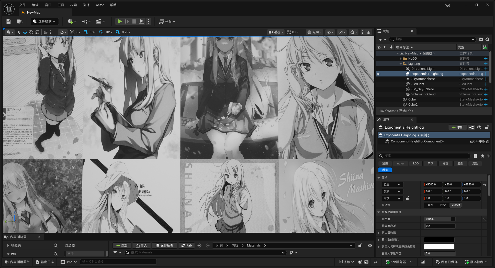 | 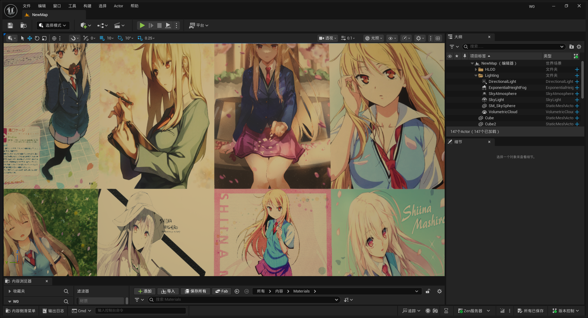 |

| 03 · Invert（反色） | 04 · Vignette（暗角） |
|:---:|:---:|
|  | 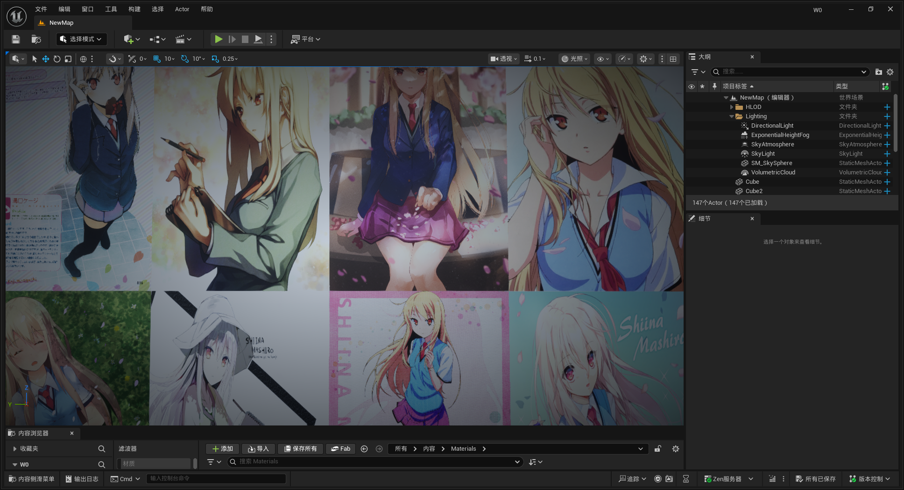 |

| 05 · Sepia（复古棕褐） | 06 · Bright/Contrast（亮度对比度） |
|:---:|:---:|
| 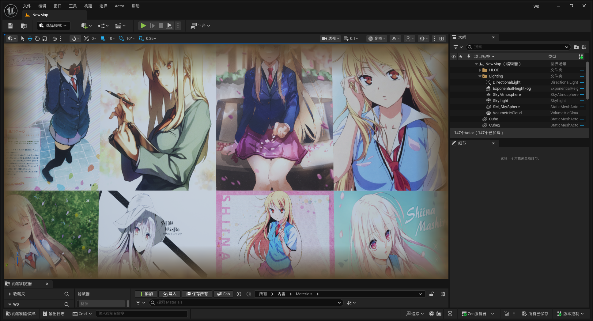 | 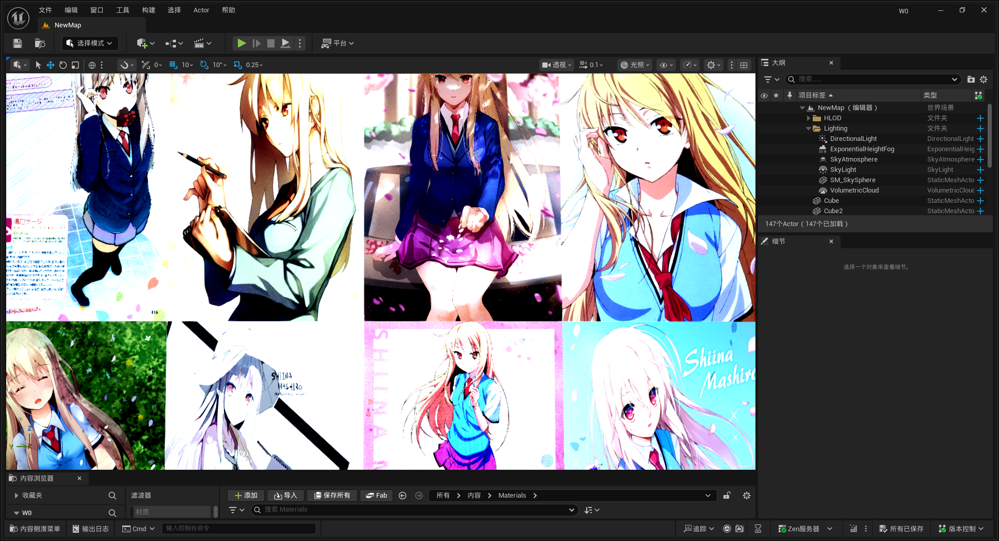 |

| 07 · Saturation Boost（饱和度增强） | 08 · RGB Split（色彩分离） |
|:---:|:---:|
| 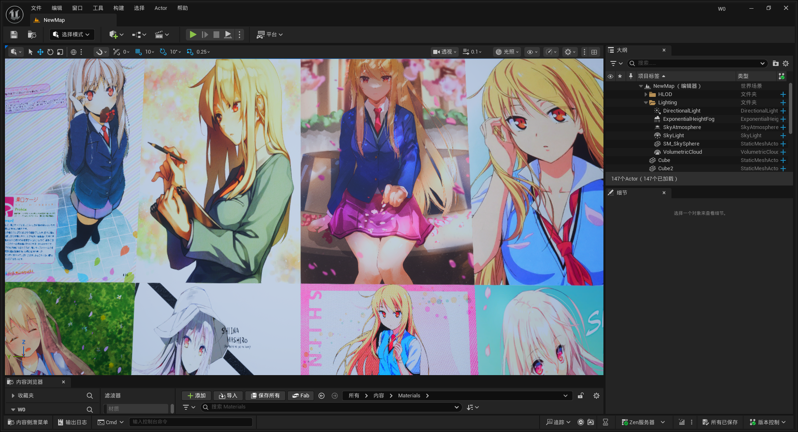 | 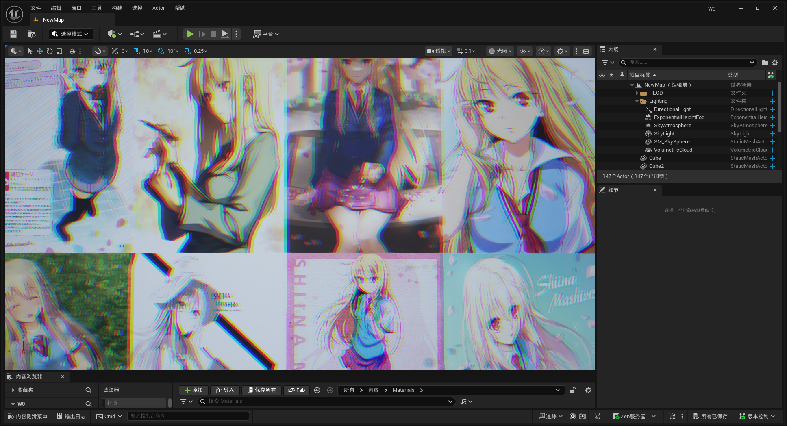 |

| 09 · Bleach Bypass（银残效果） | 10 · Old TV（老电视 CRT） |
|:---:|:---:|
| 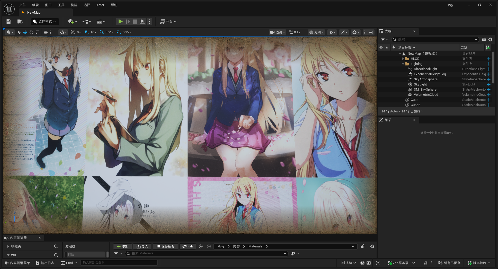 | 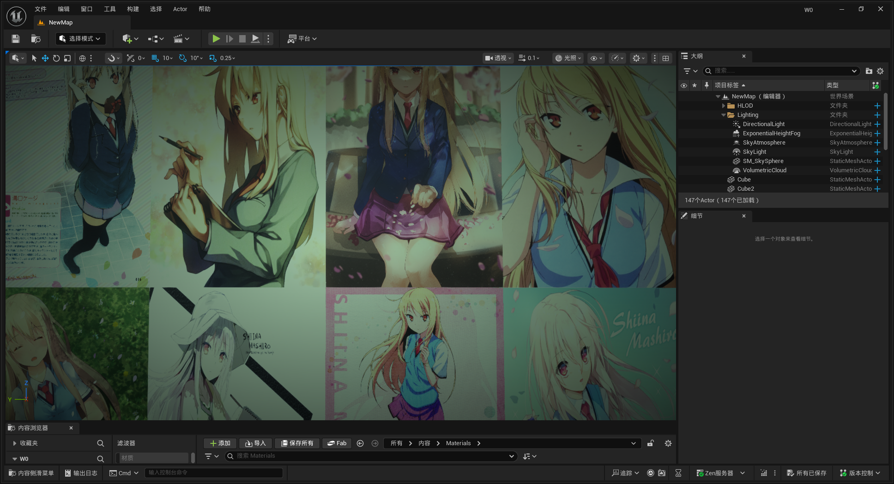 |

### 材质蓝图节点图

| 01 · Desaturate | 02 · Warm Tint |
|:---:|:---:|
| 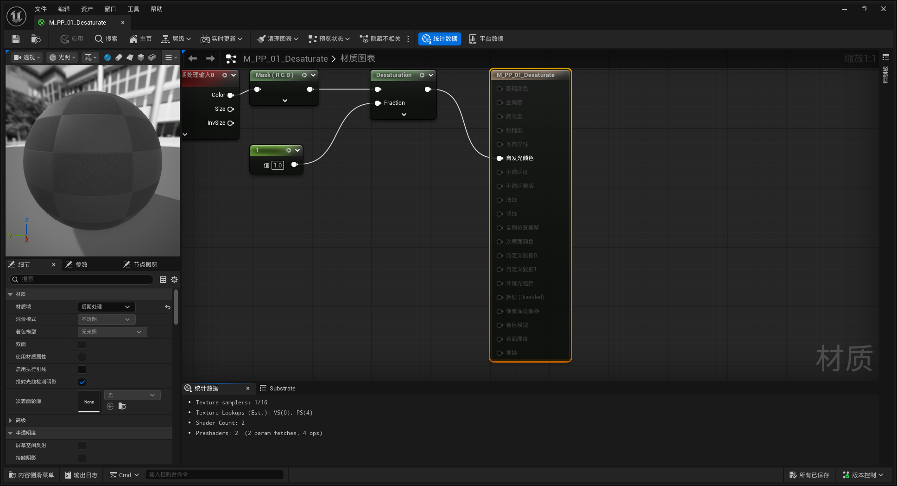 | 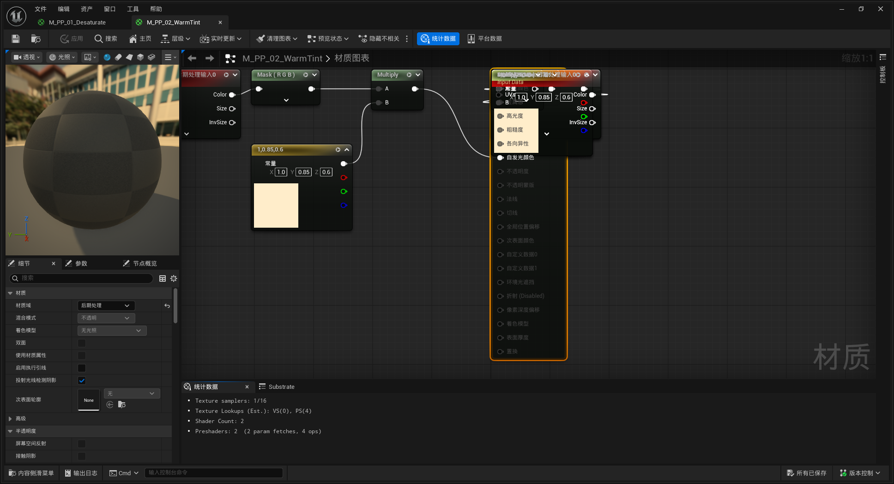 |

| 03 · Invert | 04 · Vignette |
|:---:|:---:|
| 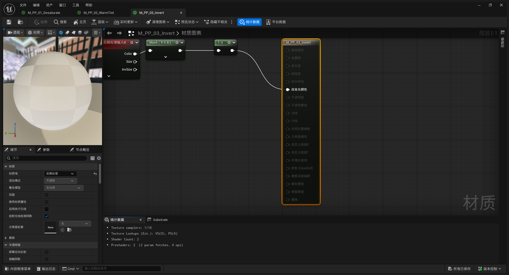 | 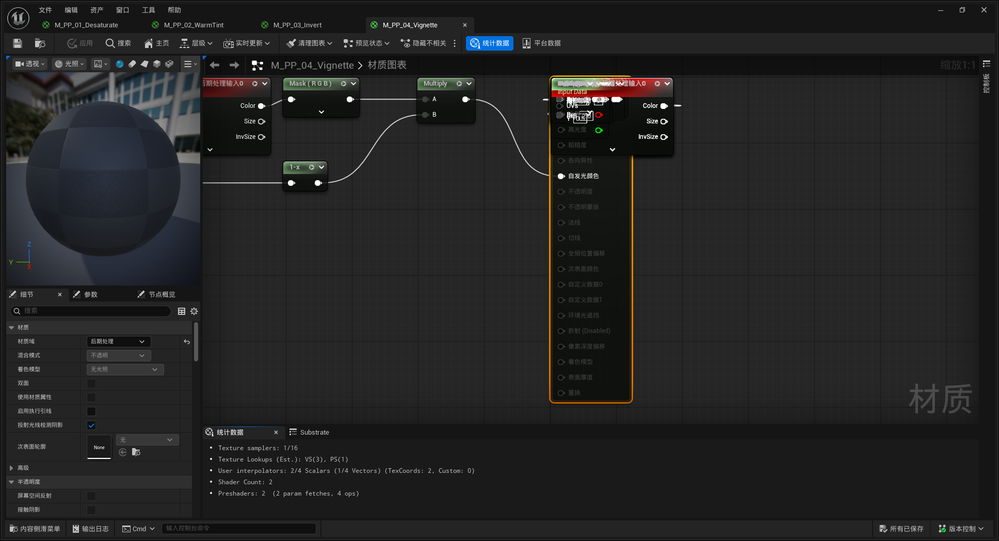 |

| 05 · Sepia | 06 · Bright/Contrast |
|:---:|:---:|
| 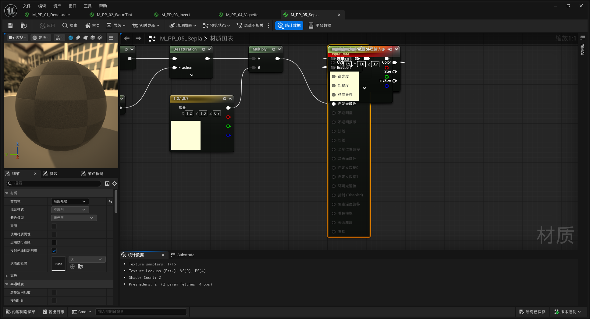 | 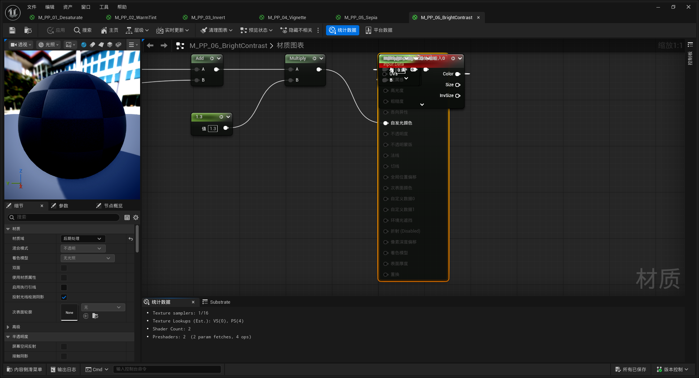 |

| 07 · Saturation Boost | 08 · RGB Split |
|:---:|:---:|
| 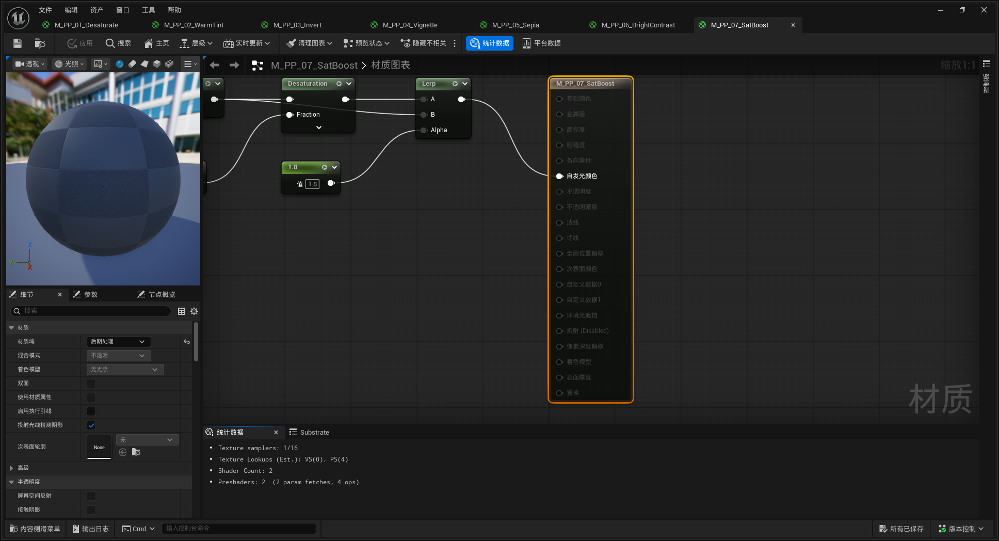 | 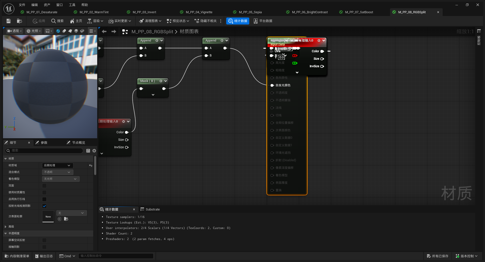 |

| 09 · Bleach Bypass | 10 · Old TV |
|:---:|:---:|
| 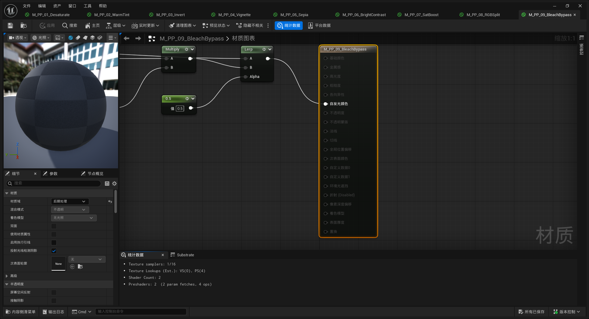 | 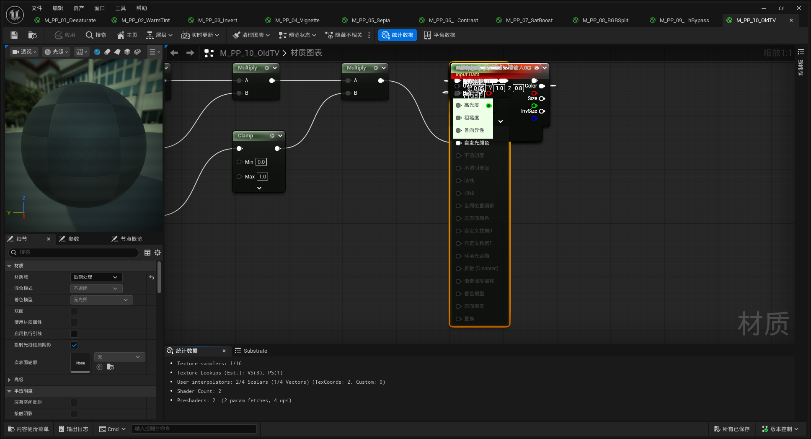 |

## 环境要求

- Unreal Engine 5.6+
- Windows / Mac / Linux（仅 Editor）

## 许可证

MIT

---

<a id="english"></a>

# UECLI - Unreal Engine Command Line Interface (English)

中文 | English

> **MCP is dead. Long live CLI.**
>
> MCP (Model Context Protocol) relies on intermediate proxy layers — long call chains, painful debugging, fragile protocols. UECLI takes the opposite approach: a TCP Server embedded directly in the Editor. Any tool that can send JSON connects to the engine directly — zero middleware, zero dependencies, millisecond response. AI Agents, scripts, CI pipelines — anyone can use it.

## What is UECLI

UECLI is a **standalone UE5 Editor plugin** that exposes **90+ commands** via a built-in TCP Server (default port `31111`), covering Material, Editor, Asset, Project, and TextureGraph domains.

- **Zero Dependencies**: No Python / Node / MCP SDK required — any language with `socket.connect()` works
- **Embedded**: Server runs inside the Editor process, commands execute on the GameThread with full engine API access
- **AI-Native**: JSON-in / JSON-out protocol naturally fits LLM Function Calling
- **Async Support**: Long-running operations via `async_execute` + `get_task_result` polling, non-blocking

## Command Coverage

| Module | Commands | Capabilities |
|--------|----------|-------------|
| **Editor** | 23 | Actor CRUD, viewport control, level management, PIE, transform, property reflection |
| **Material** | 43 | Material graph creation/editing, node connection, parameter setting, compile, material functions |
| **Asset** | 11 | List, find, rename, duplicate, import, export assets |
| **Project** | 9 | Input mapping, project settings, engine configuration |
| **TextureGraph** | 10 | Create/edit TextureGraph, add/connect nodes, set properties, export, batch patch |

## Quick Start

### 1. Install

Copy `UECLI/` into your project's `Plugins/` directory, then rebuild.

### 2. Verify

Launch the Editor, then ping the server:

```powershell
# PowerShell
powershell -ExecutionPolicy Bypass -File Plugins/UECLI/Scripts/Send-UECLI.ps1 ping
```

```bash
# Or with any TCP client
echo '{"command":"ping","params":{}}' | nc 127.0.0.1 31111
```

### 3. Explore

```powershell
# List all available commands
powershell -ExecutionPolicy Bypass -File Plugins/UECLI/Scripts/Send-UECLI.ps1 list_tools

# Create a material
powershell -ExecutionPolicy Bypass -File Plugins/UECLI/Scripts/Send-UECLI.ps1 create_material '{"name":"M_Test"}'

# Spawn an actor
powershell -ExecutionPolicy Bypass -File Plugins/UECLI/Scripts/Send-UECLI.ps1 spawn_actor '{"class":"StaticMeshActor","name":"MyActor"}'
```

## TCP Protocol

Connect to `127.0.0.1:31111` (override with `-uecliport=XXXXX`).

```jsonc
// Request
{"command": "command_name", "params": {"key": "value"}}

// Success
{"status": "success", "data": {...}}

// Error
{"status": "error", "error": "description"}
```

### Async Commands

```jsonc
// Submit
{"command": "async_execute", "params": {"command": "heavy_operation", "params": {...}}}
// → {"status": "success", "data": {"task_id": "xxx"}}

// Poll
{"command": "get_task_result", "params": {"task_id": "xxx"}}
```

## Why Not MCP?

| | MCP | UECLI |
|---|---|---|
| Architecture | App ↔ MCP Server ↔ Proxy ↔ UE | App ↔ UE (direct TCP) |
| Dependencies | Python/Node runtime, MCP SDK | None |
| Latency | ~100ms+ (IPC + protocol overhead) | <10ms (localhost TCP) |
| Debugging | Multi-process, hard to trace | Single process, `UE_LOG` |
| Stability | Protocol version mismatch, process crash | In-process, lifecycle tied to Editor |
| Integration | Only MCP-compatible clients | Any language, any tool |

## Scripts

| Script | Purpose |
|--------|---------|
| `Build-UECLI.ps1` | Build the plugin via UBT |
| `Send-UECLI.ps1` | Send a single command to the server |
| `Test-UECLI.ps1` | Run full automation test suite |
| `Smoke-UECLI.ps1` | Quick smoke test |

## Source Structure

```
Source/UECLI/
├── Public/
│   ├── UECLIModule.h                     # Module entry point
│   ├── UECLICommandlet.h                 # -run=UECLI commandlet
│   ├── ToolRegistry/
│   │   ├── UECLIToolRegistry.h           # Command registry singleton
│   │   └── UECLIToolSchema.h             # Schema & parameter definitions
│   ├── Server/
│   │   ├── UECLIServer.h                 # TCP server (UEditorSubsystem)
│   │   └── UECLIServerRunnable.h         # Listener thread
│   └── Commands/
│       ├── UECLICommonUtils.h            # JSON utils, serialization, reflection
│       ├── UECLIEditorCommands.h         # Editor commands
│       ├── UECLIMaterialCommands.h       # Material commands
│       ├── UECLIAssetCommands.h          # Asset commands
│       ├── UECLIProjectCommands.h        # Project commands
│       └── UECLITextureGraphCommands.h   # TextureGraph commands
└── Private/ (mirrors Public)
```

## Example: One-Click Post-Processing Effects

The `Create-PPEffects.ps1` script demonstrates UECLI's full automation pipeline: creating 10 post-processing materials, switching effects, and capturing screenshots — all without manual interaction. It showcases the complete chain: **Material Creation → Node Wiring → Compile → PPV Assignment → Screenshot**.

```powershell
powershell -ExecutionPolicy Bypass -File Plugins/UECLI/Scripts/Create-PPEffects.ps1
```

### Effect Gallery

| Baseline | |
|:---:|:---:|
|  | |

| 01 · Desaturate | 02 · Warm Tint |
|:---:|:---:|
|  |  |

| 03 · Invert | 04 · Vignette |
|:---:|:---:|
|  |  |

| 05 · Sepia | 06 · Bright/Contrast |
|:---:|:---:|
|  |  |

| 07 · Saturation Boost | 08 · RGB Split |
|:---:|:---:|
|  |  |

| 09 · Bleach Bypass | 10 · Old TV (CRT) |
|:---:|:---:|
|  |  |

### Material Blueprint Node Graphs

| 01 · Desaturate | 02 · Warm Tint |
|:---:|:---:|
|  |  |

| 03 · Invert | 04 · Vignette |
|:---:|:---:|
|  |  |

| 05 · Sepia | 06 · Bright/Contrast |
|:---:|:---:|
|  |  |

| 07 · Saturation Boost | 08 · RGB Split |
|:---:|:---:|
|  |  |

| 09 · Bleach Bypass | 10 · Old TV |
|:---:|:---:|
|  |  |

## Requirements

- Unreal Engine 5.6+
- Windows / Mac / Linux (Editor only)

## License

MIT
